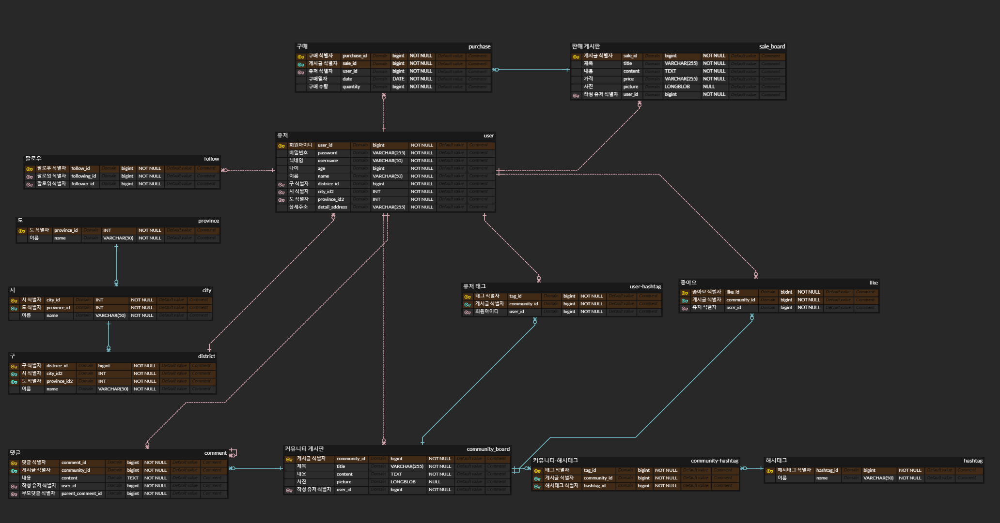

# SellingCommunity_ERD

SellingCommunity_ERD 설계

링크: https://www.erdcloud.com/d/f6SfW9H8HjkXxZBnN

요구사항, 추가 요구사항 모두 반영했습니다.
---

### 요구사항

1. 유저는 회원아이디,비밀번호,이름,나이,주소를 통해 가입가능하고 id로 식별(기본키)한다.
2. 커뮤니티 게시판은 게시글 작성 유저, 제목, 내용, 사진 정보가 있고 id로 식별(기본키)한다.
3. 댓글은 댓글 작성 유저, 내용 정보가 있고 id로 식별(기본키)한다.
4. 판매 게시판은 판매 글 작성 유저, 제목, 내용, 가격, 사진 정보가 있고 id로 식별(기본키)한다.
5. 유저는 커뮤니티게시글에 좋아요를 누를수 있다. 좋아요는 id로 식별(기본키)한다.
6. 유저는 판매게시판의 올라온 물품을 구매 할 수 있다.
7. 유저가 물품을 구매하면 구매에 대한 구매일자,구매수량을 유지해야한다. 구매는 id로 식별(기본키)한다.

---

## 추가 요구사항

1. 유저 엔티티에 주소를 도, 시, 구를 목록에서 선택하고 가입할 수 있게 엔티티를 추가or변경 하고 기존주소 속성은 상세주소로 바꿔보세요.
2. 댓글 기능을 댓글과 대댓글이 가능하도록 엔티티를 추가 or 변경 해보세요.
3. 커뮤니티 게시판에 해시태그 기능과 유저태그 기능 구현을 위한 엔티티를 추가 or 변경 해보세요.
4. 유저 끼리의 팔로잉 팔로워 기능 구현을 위한 엔티티를 추가or변경 해보세요.
